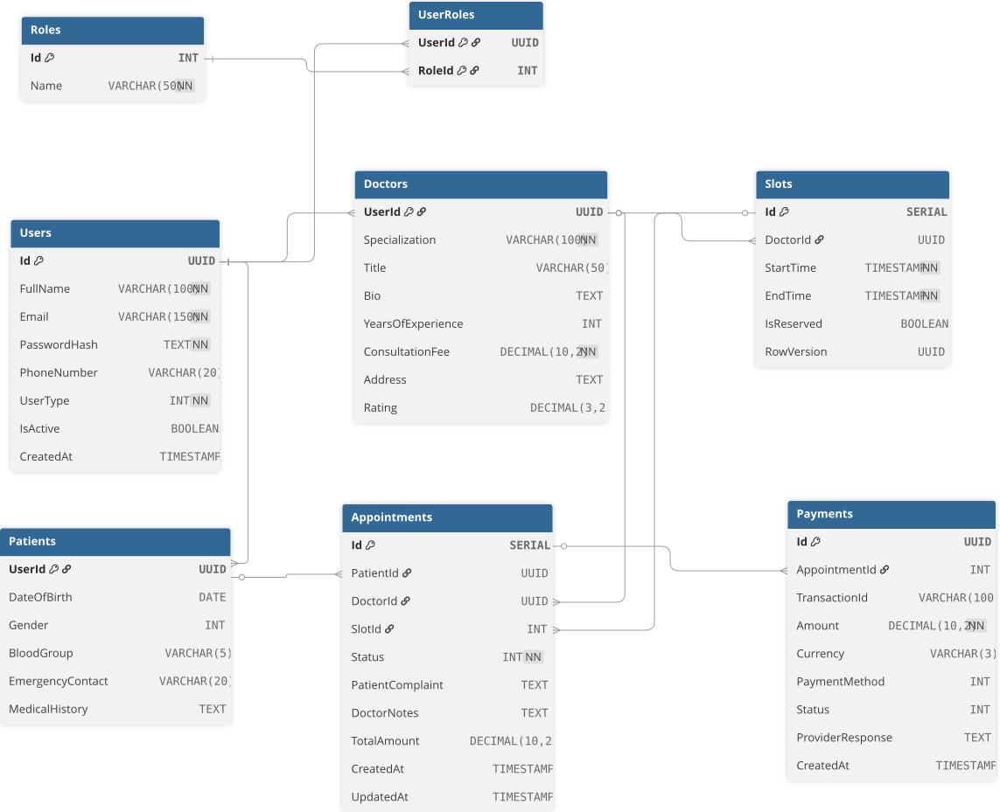

# ViteCare System 

An enterprise-grade **Clinic Management System** built with **.NET 8** and **Next.js**, following **Clean Architecture** and **SOLID** principles.

## Technologies

- **Backend:** .NET 8 Web API.
- **Database:** SQL Server with Entity Framework Core.
- **Architecture:** Clean Architecture (Domain, Application, Infrastructure, API).
- **Communication:** SignalR for real-time notifications & gRPC for microservices.
- **Caching:** Redis.

## Database Schema

This project uses a highly optimized schema to handle appointments and doctor schedules.

## Features (Under Development)

- **Role-based Access Control (RBAC):** Admin, Doctor, and Patient roles.
- **Advanced Scheduling:** Slot-based booking system with concurrency handling.
- **Payments:** Integrated with Paymob/Stripe.
